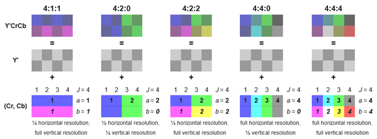
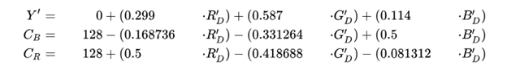
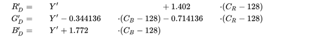

# Chroma Subsampling Algorithm

## Overview

Chroma Subsampling is a technique for reducing the amount of color information in an image by lowering the resolution of the chrominance components (Cb and Cr) compared to the luminance component (Y). Since the human eye is more sensitive to changes in brightness than color, this technique reduces chromatic data without significantly affecting perceived image quality.

This method is widely used in formats like 4:2:2 and 4:2:0, where some color information is shared among adjacent pixels. This efficiently reduces file size while maintaining high visual quality. The subsampling methods implemented in this project include 4:2:0, 4:2:2, 4:4:0, and 4:1:1.

*The 4:4:4 format represents the original uncompressed image*

## Class Details

### YCbCr
- Represents the three components of chroma subsampling in a two-dimensional byte array: two chrominance components (Cb and Cr) and one luminance component (Y)
- Converts the color of each pixel in the image to the appropriate byte value of the corresponding subsampled component

### ChromaSubsampling
**Abstract Base Class**: Holds shared variables and methods for all subsampling types.

**Variables**:
- Bitmap: Used for reading, processing, and converting images back to their original or decompressed formats
- YCbCr objects for the original, compressed, and decompressed image data
- Integer variables for the original image size and the size of the compressed chrominance data

**Constructor**: Initializes shared variables for all subsampling types corresponding to the original image size. Uses the System.Drawing library for converting the image into a Bitmap and pixel manipulation with the Color object.

**Methods**:
- **ConvertRGBtoYCbCr**: Converts each pixel's RGB values to Y, Cb, and Cr subsampled components using mathematical formulas:

- **VisualizeCb** and **VisualizeCr**: Converts Cb and Cr components back into color format for creating chrominance maps for comparison
- **RGBNormalize**: Ensures RGB values remain within the valid range [0,255]. Out-of-range values are clamped accordingly

### CSCompression411/420/422/440
Derived classes for specific subsampling types.

**Constructor**: Initializes the size of the chrominance components and subsampled YCbCr objects based on the selected subsampling type:
- **4:2:0**: Subsamples in 2x2 blocks
- **4:2:2**: Subsamples in horizontal 2-pixel blocks
- **4:4:0**: Subsamples in vertical 2-pixel blocks
- **4:1:1**: Subsamples in horizontal 4-pixel blocks

**Methods**:
- **Compression**: Compresses the chrominance components by averaging pixel values according to the subsampling type
- **Decompression**: Decompresses by replicating averaged values across blocks to match the original image size
- **VisualizeCb** and **VisualizeCr**: Converts decompressed Cb and Cr components back into color format for comparison maps
- **ConvertYCbCrToRGB**: Converts YCbCr values back into RGB values using mathematical formulas:

## Technical Details

- Project is written in C# using Visual Studio 2019 and .NET Framework 4.7.2
- The solution contains two project files:
  - **Compression Code**: Contains the algorithm implementation
  - **UI**: A forms-based application that executes the compression. The compression project is set as a library

## Challenges and Decisions

1. **Image Format Compatibility**: Saving compressed images in formats like JPEG sometimes results in external compression, affecting the demonstration of the algorithm. To address this:
   - Added UI visualization of chrominance maps before compression and after decompression
   - Ensured images are displayed at 100% resolution in the UI for optimal compression effect visualization

2. **Video Support**: Implementing video processing requires frame-by-frame analysis, which was not feasible due to library constraints. Video implementation was omitted for this reason.
